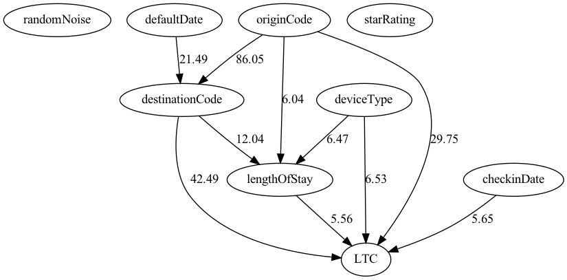

# Ltc Prediction


## Running locally/remotely

### Building

`make build`

Then, running the pipe is done from the command line, in the following way:

### Feature extraction

*Running time*: Short (few minutes).

This stage takes the data from BENs matching and hotels static and does the feature extraction for the next phase. (Mainly converts the data format into the ``unified representation'' which is and array of integers as features, and an single integer as the lable.

`make local_feature_extraction` for local run, or

`make remote_feature_extration` for remote run.

The parameters for the run is read from `ltcPrediction/src/main/resources/sgprod/network_topology.conf`.
Main features are:
1. Job name.
1. Data dates (change that to the dates you need).
1. Data sample rate (More or less data to consume).
1. Main class entry name (don't change this unless you know what it is your doing).

### Network topology builder

*Running time*: Long (6-8 hours).

This stage builds the topology of the network.
It's input is the output of the _feature extraction_ phase described above.
The output is a json file that describes the topology of the netwrok.
The _edge relaxation_ process, in which edges with low scores are omitted is needed (see more below).

`make local_build_network` for local run, or
`make remote_build_network` for remote run.

## Post processing for the network topology

This phase is consisted of two phases:
1. Ommiting edges by threshold.

Ommiting the edges is done by `python ommit_edges.py `
You need to provide the command line parameters as shown below:

```
usage: Edge Ommitter [-h] -i INPUT_FILE -t THRESHOLD -o OUTPUT_FILE

Ommits graph edges by a given threshold

optional arguments:
  -h, --help            show this help message and exit
  -i INPUT_FILE, --input-file INPUT_FILE
  -t THRESHOLD, --threshold THRESHOLD
  -o OUTPUT_FILE, --output-file OUTPUT_FILE
```

The command line utility will remove all the edges below the given threshold from the graph.

2. Export to picture/pdf.

Exporting the graph into a _dot_ file is done by the following:

`python3 ltcPrediction/src/main/python/run_export.py`

You need to provide parameters as listed below:

```
usage: Graph export [-h] -i INPUT -o OUTPUT -t EDGE_THRESHOLD

Convert graph from json format to dot

optional arguments:
  -h, --help            show this help message and exit
  -i INPUT, --input INPUT
  -o OUTPUT, --output OUTPUT
  -t EDGE_THRESHOLD, --edge-threshold EDGE_THRESHOLD
```

You can also use the command below, which would do the export from _dot_ to png and will open the result.

`JSON=<json input file> make OUT=<png output file> EDGE_THRESHOLD=<edge threshold> local_export_graph`

The result should like something like this:

